# Lab: Building a License Swap Eligibility Agent with IBM watsonx Orchestrate

## Overview

In this hands-on lab, you will build a no-code AI agent using **IBM watsonx Orchestrate** that helps users check whether they qualify to swap a foreign driving license for a UAE driving license — without sitting a driving test.

The agent walks the user through the process step by step:

1. Asks the user to upload their driving license
2. Automatically reads and extracts the license details
3. Checks eligibility based on nationality
4. Returns a personalised response — either a confirmation or a not-eligible message

**Estimated time:** ~30 minutes

---

## Prerequisites

- An IBM watsonx Orchestrate Cloud account. You can sign up for free here: https://www.ibm.com/account/reg/us-en/signup?formid=urx-52753

---

## Step 1 — Create a watsonx Orchestrate Trial Instance

1. Go to the **IBM SaaS Console** (https://console.saas.ibm.com/dashboard/subscriptions) and navigate to **Instances**.


> **Note:** You may be asked to set up multi-factor authentication. Choose **Email**, enter the code you receive, and verify.

2. Click **Create instance +** (top-right).

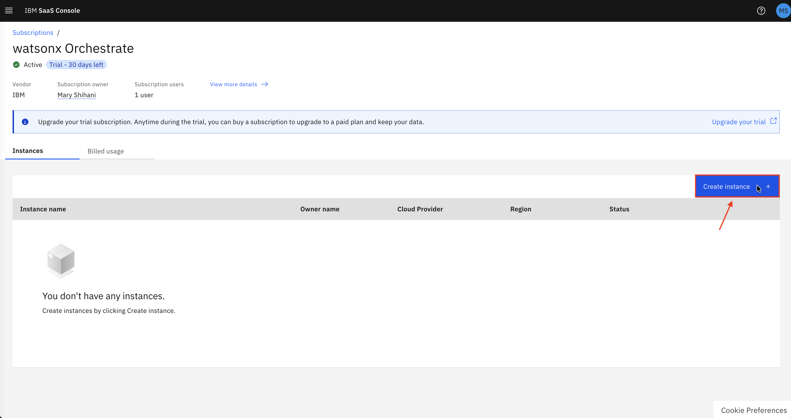

3. Fill in the instance details as shown below:


4. Click **Create**.
5. Wait until the instance status shows **Running**, then click **Launch** to open watsonx Orchestrate.


> **Note:** If you see "Your account is not provisioned yet", wait a minute and try launching again.

---

## Step 2 — Create the Agent

1. From the watsonx Orchestrate home screen, click **Create your agent**.

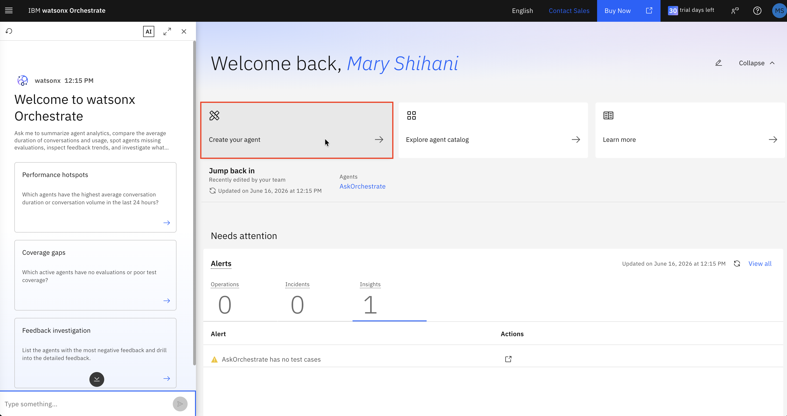

2. Select **Create from scratch**.

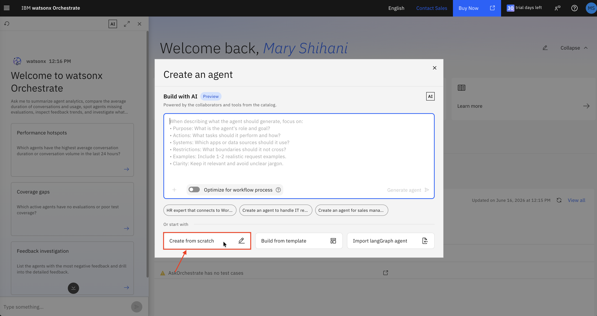

3. Fill in the following details:

   | Field | Value |
   |---|---|
   | **Name** | `License Swap Eligibility Agent` |
   | **Description** | Copy the full description below |

   **Agent Description:**
   > You are a License Swap Eligibility Agent to help users check if they qualify to swap a foreign driving license for a UAE license without taking tests. Using the License Swap Eligibility Check tool, you guide users through each step of the eligibility process, starting with license upload and automated detail extraction, followed by eligibility checks using deterministic logic. The tool verifies that the issuing country is eligible, that the license is still valid, and that the applicant is at least 18. You handle human-in-the-loop activities like form submissions and confirmation messages, and generate personalized responses using AI prompts.

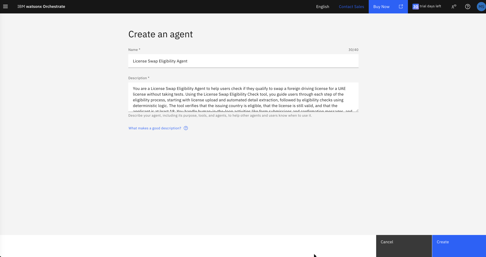

4. Click **Create**.

---

## Step 3 — Configure the Agent Profile

After the agent is created, you will be on the **Profile** tab.

### Welcome Message

Update the default welcome message to:

```
Hello, welcome to License Swap Agent
```

### Quick Start Prompts

1. Click **Add prompt +**.
2. Enter: `Check License swap eligibility.`
3. Delete all other default prompts.

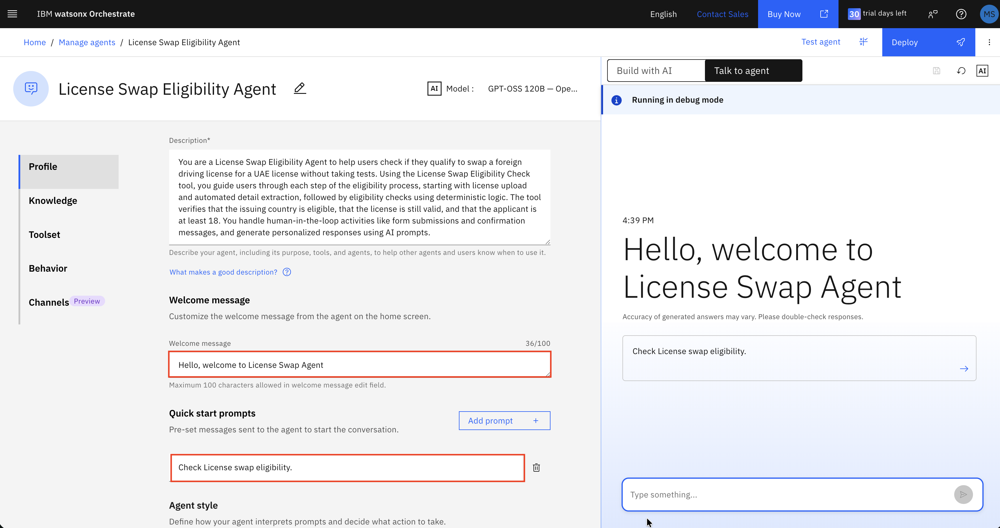

---

## Step 4 — Configure Agent Behavior

1. Click **Behavior** in the left sidebar.
2. Paste the following into the **Instructions** field:

   > When the user requests to swap a foreign license for a UAE license, call the tool "License Swap Eligibility Check" and do not generate or display any additional output. The tool is fully responsible for handling the process and presenting the final response to the user. Your role is strictly to delegate the task to the tool. Do not repeat, summarize, or echo the tool's output, as it already includes the necessary user-facing messages.


---

## Step 5 — Create the Workflow Tool

> A **workflow** is a step-by-step automated process. You will build one that collects the license, reads it, checks eligibility, and returns a response — all automatically.

### 5.1 Open the Toolset and Add a Tool

1. Click **Toolset** in the left sidebar.
2. Click **Add tool +**.

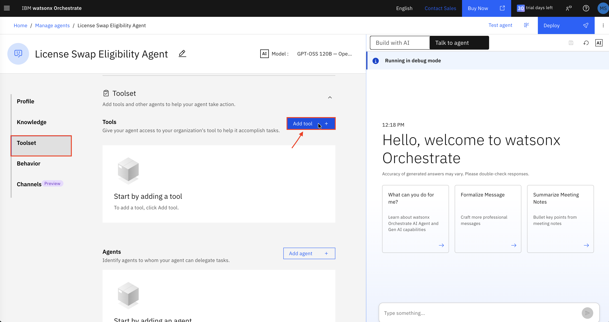

3. In the dialog, select **Agentic workflow** under *Create new*.


4. Name the workflow: `License Swap Eligibility Check`
5. Click **Start building**.

---

### 5.2 Workflow Step 1 — Display a Welcome Message

You are now inside the workflow builder (the canvas).

1. Click **Add your first step +**.
2. Select **Present to user → Message**.

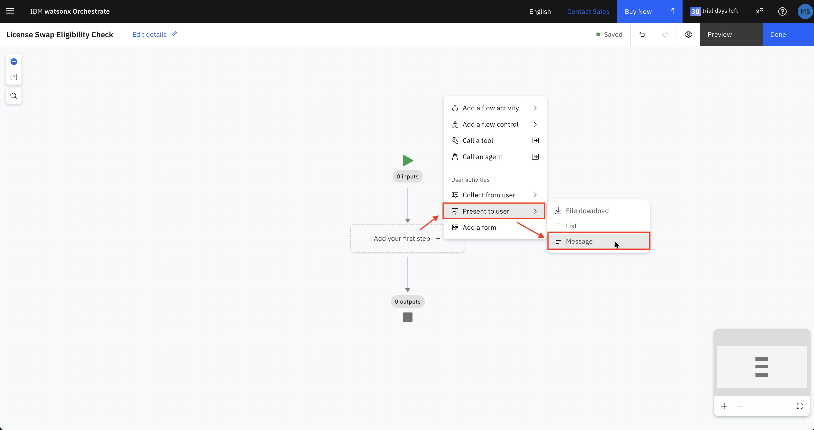

3. In the **Output message** field on the right, enter:

   ```
   To get started please upload the driving license.
   ```

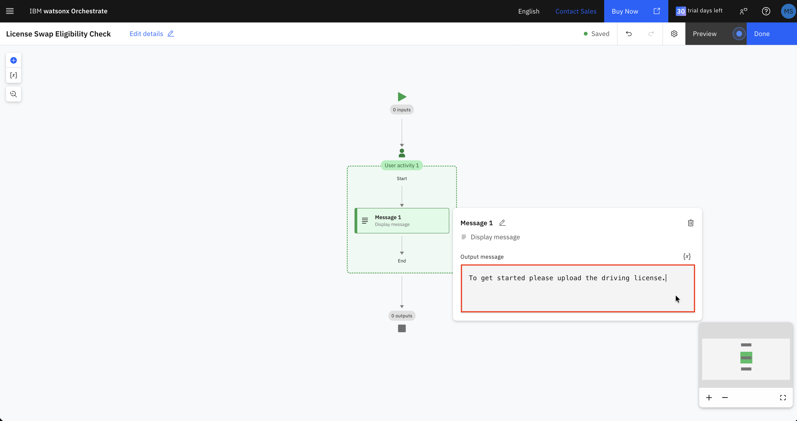

---

### 5.3 Workflow Step 2 — Add a File Upload

1. Click the **+** button below the Message node.

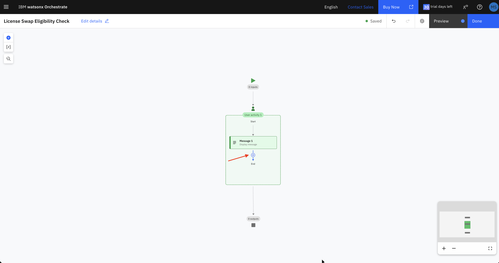

2. Select **Collect from user → File upload**.


This lets the user attach their driving license image or PDF.

---

### 5.4 Workflow Step 3 — Extract License Details

> The **Document Extractor** automatically reads the uploaded image and pulls out key fields — like name, nationality, and expiry date — without any manual entry.

1. Click the **+** button **below** the User activity block (outside the green dashed box, on the main canvas).
2. Select **Add a flow activity → Document extractor**.


3. Choose **Structured** as the document format.

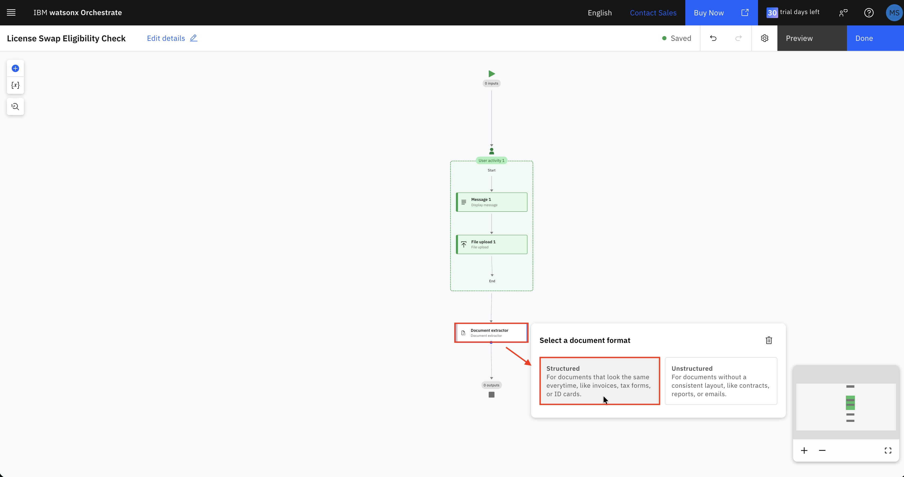

4. Click **Define schema**, then choose the predefined schema: **Driver license**.


5. Keep only the fields listed below — remove everything else:

   | Field | Type |
   |---|---|
   | License number | string |
   | Full name | string |
   | Date of birth | date |
   | Nationality | string |
   | Date of issue | date |
   | Date of expiration | date |

6. To test the extraction, upload the sample image `Training.png` from the `sample-licenses/` folder in this repo.


7. Click **Create**.

---

### 5.5 Workflow Step 4 — Add a Branch (Eligibility Check)

> A **Branch** is a decision point. Depending on the answer to a condition, the flow takes one of two different paths.

1. Click the **+** button below the Document extractor node.
2. Select **Add a flow control → Branch**.

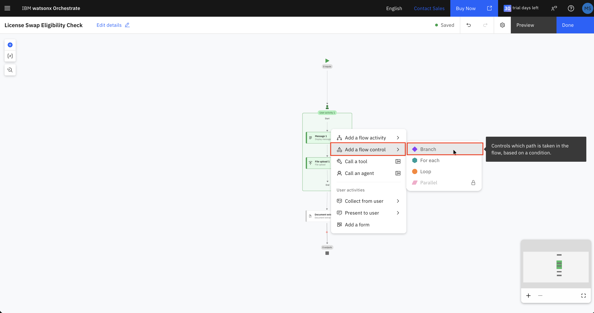

A **Branch 1** diamond appears with two paths:
- **Path 1** — triggered when the condition is true (we'll use this for ineligible nationalities)
- **Path 2 (default)** — triggered when no condition matches (eligible nationalities)

---

### 5.6 Configure Path 1 — Ineligible Nationalities

Path 1 catches nationalities that are **not** eligible for a UAE license swap.

1. Click **Branch 1**, then click **Edit condition** next to **Path 1**.

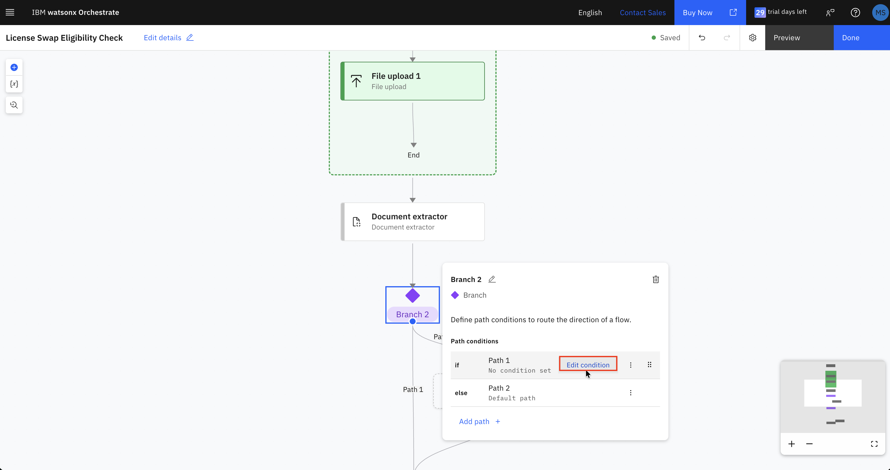

2. Click **+** to add a condition, then set it as follows:
   - Click the variable picker → **Document extractor** → `nationality`
   - Operator: `==`
   - Value: `Cameroonian`

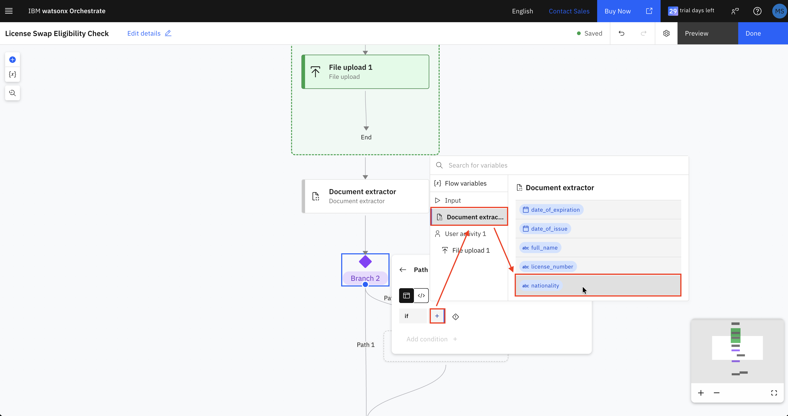

3. Click **+** again, change the operator between conditions to **or**, and add:
   - `nationality == Indian`

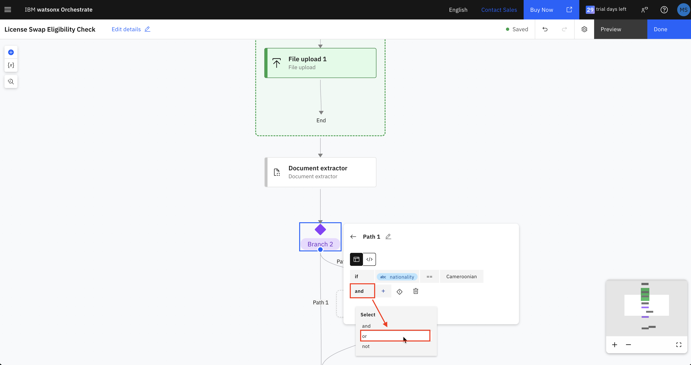

4. Repeat to add the remaining ineligible nationalities:
   - `nationality == Pakistani`
   - `nationality == Nigerian`

5. Click **Back** to return to the branch overview.

---

### 5.7 Configure Path 2 (Default) — Eligible Response

Path 2 handles eligible nationalities and generates a personalised confirmation message.

> A **Generative prompt** gives the AI a set of instructions and the extracted data, and the AI writes the final message for the user.

1. In **Path 2**, click **+** to add a step.
2. Select **Add a flow activity → Generative prompt**.
3. Enter the following:

   **System prompt:**
   ```
   You are an assistant that generates the final confirmation message for a license swap application. Your task is to take the provided user details (license number, full name, date of birth, nationality, date of issue, and date of expiration) and produce a complete, ready-to-send message. Do not provide instructions or code, only return the final text output.
   ```

4. Add the following inputs. Click **Add +** → **String** for:
   - name: `full_name` 
   - name: `nationality` 

   Click **Add +** → **Date** for:
   - name: `issue_date` 
   - name: `expiry_date` 
   - name: `birth_date` 

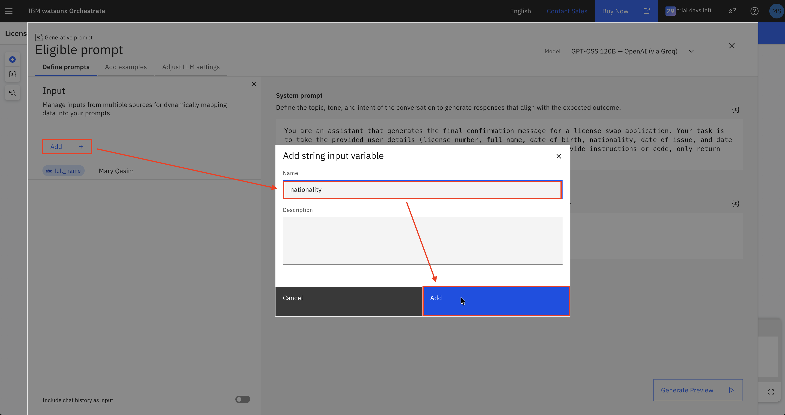

5. **User prompt:**

   ```
   Generate a confirmation message using the following details:

   Full Name: {self.input.full_name}
   Nationality: {self.input.nationality}
   Issue Date: {self.input.issue_date}
   Expiry Date: {self.input.expiry_date}
   Birth Date: {self.input.birth_date}

   The message should:
   - Start with a greeting and thank the customer by their full name.
   - Confirm that the customer is eligible for a license swap.
   - Confirm that the request was submitted successfully.
   - Include a random 8-digit reference number.
   - State that one of our agents will contact the customer for the next steps.
   - End with the company name: Road and Transportation Authority.
   ```

6. Click **Generate Preview** to check the output looks correct.
7. Close the panel.
8. Rename it to `Eligible prompt`.

---

### 5.8 Configure Path 1 — Not-Eligible Response

Path 1 generates a polite message informing the user they are not eligible.

1. In **Path 1**, click **+** to add a step.
2. Select **Add a flow activity → Generative prompt**.
3. Enter the following:

   **System prompt:**
   ```
   You are an assistant that generates the final confirmation message for a license swap application. Your task is to take the provided user details (license number, full name, date of birth, nationality, date of issue, and date of expiration) and produce a complete, ready-to-send message. Do not provide instructions or code, only return the final text output.
   ```

4. Add the following inputs. Click **Add +** → **String** for:
   - name: `full_name` 
   - name: `nationality` 

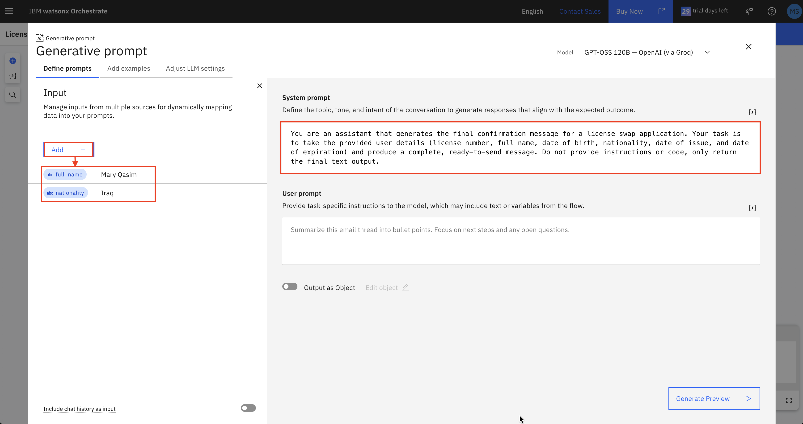

5. **User prompt:**

   ```
   Generate a message using the following details:

   Full Name: {self.input.full_name}
   Nationality: {self.input.nationality}

   The message should:
   - Start with a greeting addressing the customer by their full name.
   - Politely inform the customer that they are not eligible for a license swap at this time.
   - Advise them to contact or visit the centre for further assistance and to discuss available options.
   - Do NOT mention a specific reason for ineligibility.
   - Do NOT include a reference number.
   - Do NOT confirm any request as submitted.
   - Keep a respectful and supportive tone.
   - End with the company name: Road and Transportation Authority.
   ```

6. Click **Generate Preview** to check the output looks correct.
7. Close the panel.
8. Rename it to `Not-Eligible prompt`.

---

### 5.9 Map Both Prompts to the Output Node

Both paths connect to a single **Output** node. Here you will name the two outputs and link each one to the correct generative prompt.

1. Click the **Output** node on the canvas.
2. Click **Add** → **String**, enter the name `Eligible`, then click **Add**.
3. Click **Add** → **String**, enter the name `Not-Eligible`, then click **Add**.
4. Click **Edit data mapping**.

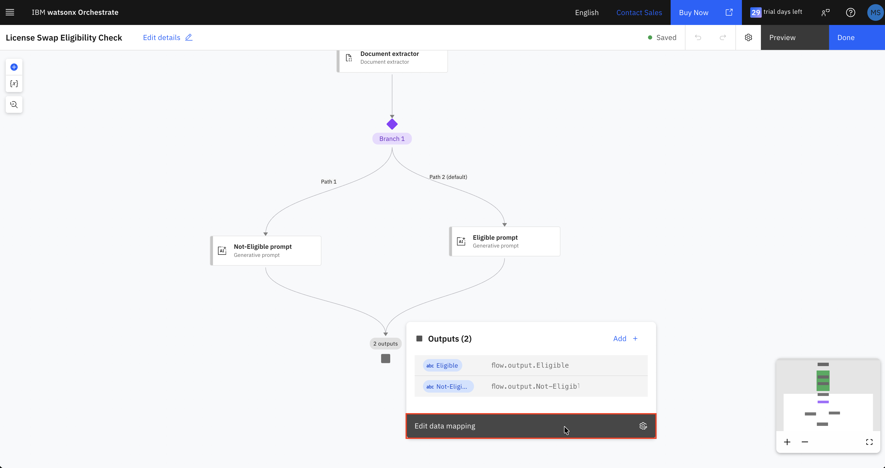

5. For **Eligible**, click the **{x}** variable picker and select **Eligible prompt → Value**.
6. For **Not-Eligible**, click the **{x}** variable picker and select **Not-Eligible prompt → Value**.

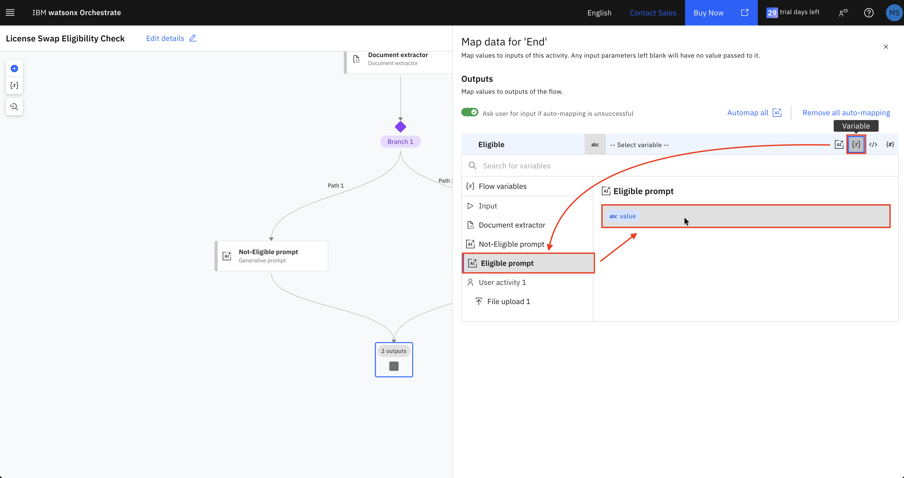

---

### 5.10 Exit the Workflow

1. Click **Done** (top-right) to return to the agent.

The workflow is now saved and automatically added to your agent's toolset.

---

## Step 6 — Test the Agent

1. In the right-hand panel, click **Talk to agent**.
2. Click the quick-start prompt: **Check License swap eligibility.**
3. The agent should display:

   > *To get started please upload the driving license.*

4. Upload a driving license image. You can use `Testing.png` from the `sample-licenses/` folder in this repo.
5. The system will automatically read your license and extract the details.
6. Depending on the nationality on the license:
   - **Eligible nationality** → you will receive a personalised confirmation message with a reference number.
   - **Not-eligible nationality** → you will receive a polite message advising you to visit a branch.

---

## Workflow Summary

```
[Start]
   │
   ▼
[User Activity]
   ├── Message: "To get started please upload the driving license."
   └── File Upload
   │
   ▼
[Document Extractor]
   Extracts: license_number, full_name, date_of_birth,
             nationality, date_of_issue, date_of_expiration
   │
   ▼
[Branch 1]
   ├── Path 1 — nationality is NOT eligible
   │       └── [Not-Eligible prompt] → personalised not-eligible message
   │
   └── Path 2 (default) — nationality IS eligible
           └── [Eligible prompt] → personalised confirmation message
   │
   ▼
[Output]
   ├── Eligible     ← Eligible prompt.value
   └── Not-Eligible ← Not-Eligible prompt.value
```

---

## Key Concepts

| Concept | What it does |
|---|---|
| **Agentic Workflow** | A step-by-step automated process the agent follows |
| **Document Extractor** | Reads an uploaded image and pulls out structured fields automatically |
| **Branch** | A decision point that routes the flow based on a condition |
| **Generative Prompt** | Instructs the AI to write a personalised message using the extracted data |
| **Behavior Instructions** | Tells the agent to delegate fully to the workflow tool |

---

## Conclusion

You have successfully built a no-code License Swap Eligibility Agent using IBM watsonx Orchestrate. The agent:

- Accepts a driving license upload from the user
- Automatically extracts the key details using a document extractor
- Checks eligibility based on nationality using a branch
- Returns a personalised AI-generated response for both eligible and not-eligible users

This pattern — document extraction, conditional branching, and generative AI — can be applied to many other document-driven eligibility workflows.
