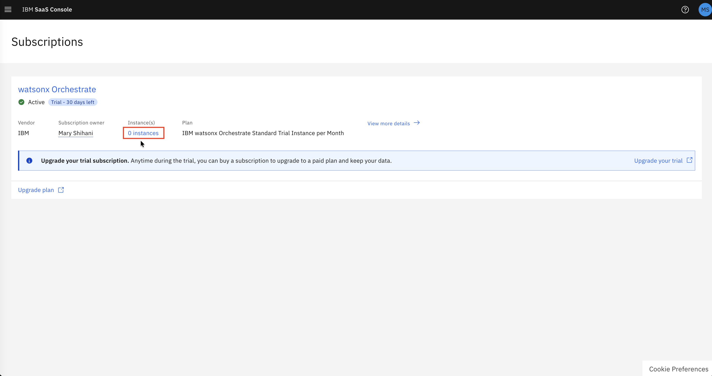
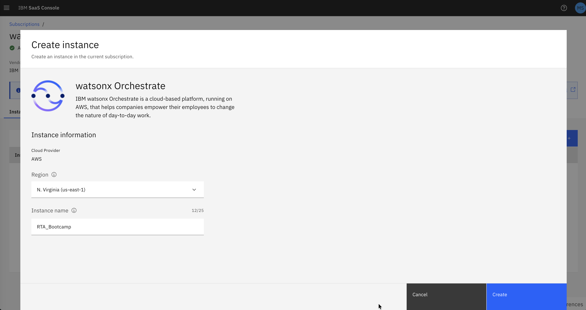
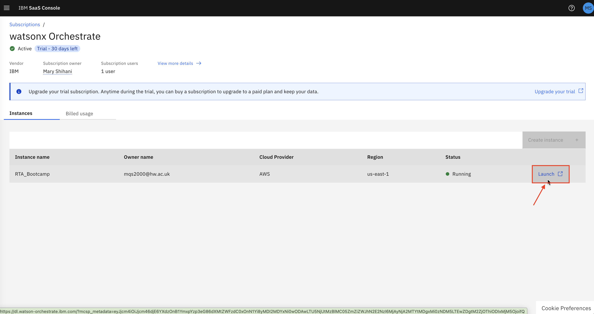
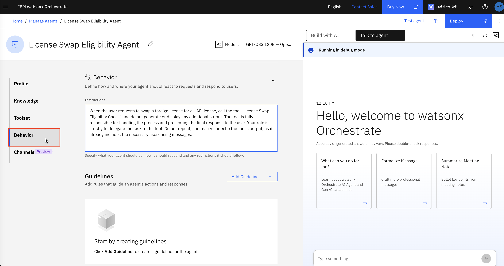
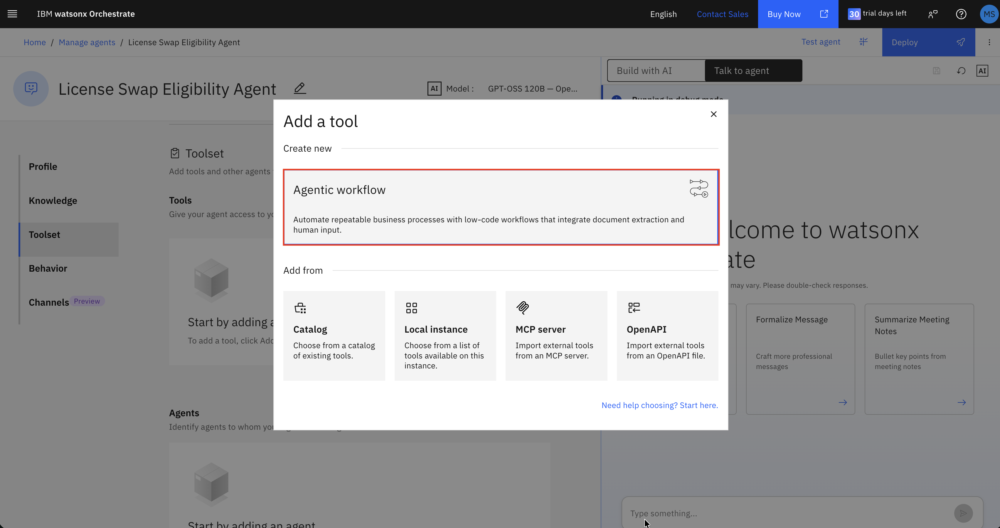
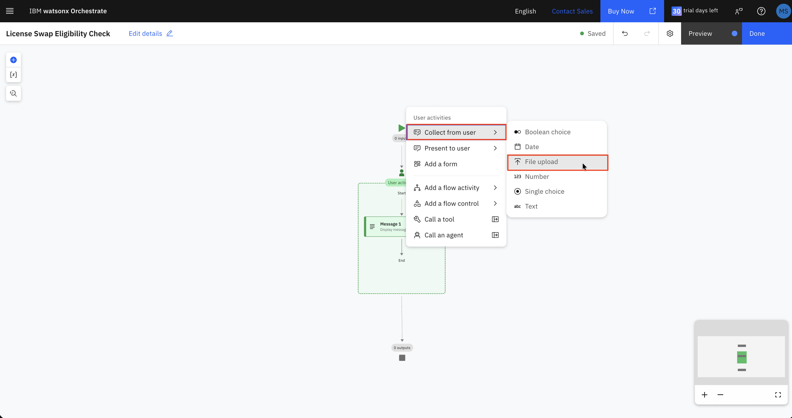
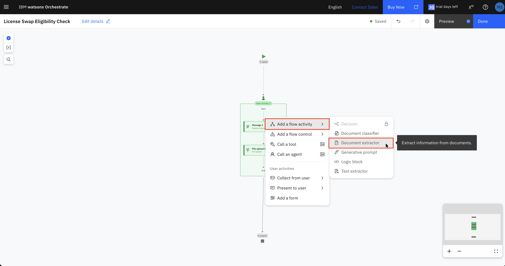
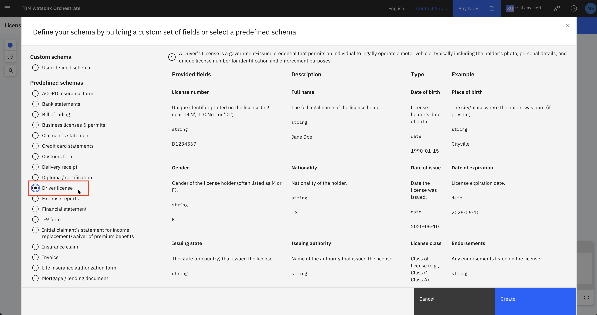
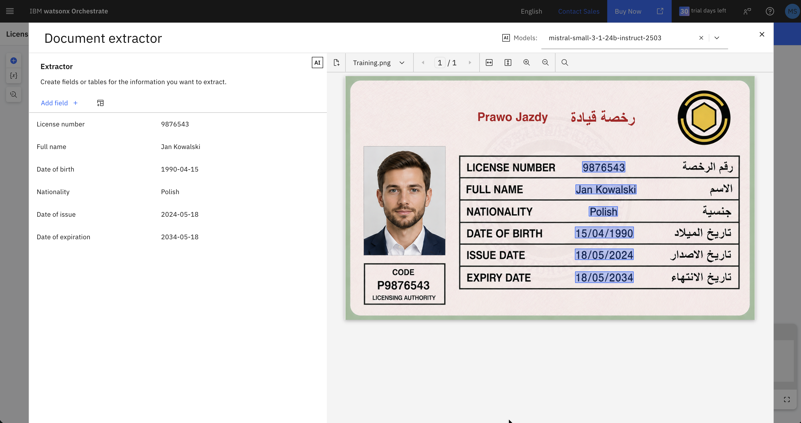

# Lab: Building a License Swap Eligibility Agent with IBM watsonx Orchestrate

## Overview

In this hands-on lab, you will build a no-code AI agent using **IBM watsonx Orchestrate** that helps users check whether they qualify to swap a foreign driving license for a UAE driving license — without sitting a driving test.

The agent guides the user through the eligibility process step by step:

1. Collects the user's driving license via file upload
2. Automatically extracts details from the license using a Document Extractor
3. Applies deterministic eligibility logic via a Branch condition
4. Returns a personalised confirmation message (eligible) or a branch-visit message (not eligible)

---

## Prerequisites

- An IBM Cloud account you can get one here -> https://www.ibm.com/account/reg/us-en/signup?formid=urx-52753

---

## Step 1 — Create a watsonx Orchestrate Trial Instance

1. Go to the **IBM SaaS Console** [https://console.saas.ibm.com/dashboard/subscriptions] and navigate to **Instances**.



> **Note:** You might be asked to set up multi-factor authentication. Choose email, wait for the code, and verify.

2. Click **Create instance +** (top-right).


3. Fill in / choose the instance details as follows:



4. Click **Create**.
5. Once the instance status shows **Running**, click **Launch** to open watsonx Orchestrate.



> **Note:** If you see "Your account is not provisioned yet", wait a few minutes and then try launching again.

---

## Step 2 — Create the Agent

1. From the watsonx Orchestrate home screen, click **Create your agent**.


2. In the dialog, select **Create from scratch**.


3. Enter the following details:

   | Field | Value |
   |---|---|
   | **Name** | `License Swap Eligibility Agent` |
   | **Description** | See full description below |

   **Agent Description:**
   > You are a License Swap Eligibility Agent to help users check if they qualify to swap a foreign driving license for a UAE license without taking tests. Using the License Swap Eligibility Check tool, you guide users through each step of the eligibility process, starting with license upload and automated detail extraction, followed by eligibility checks using deterministic logic. The tool verifies that the issuing country is eligible, that the license is still valid, and that the applicant is at least 18. You handle human-in-the-loop activities like form submissions and confirmation messages, and generate personalized responses using AI prompts.

4. Click **Create**.


---

## Step 3 — Configure the Agent Profile

After the agent is created, you will be on the **Profile** tab.

### Welcome Message

Leave the default welcome message or update it to:

```
Hello, welcome to License Swap Agent
```

### Quick Start Prompts

1. Click **Add prompt +**.
2. Enter: `Check License swap eligibility.`
3. Remove all the other prompts.


---

## Step 4 — Configure Agent Behavior

1. Click **Behavior** in the left sidebar.
2. In the **Instructions** field, enter:

   > When the user requests to swap a foreign license for a UAE license, call the tool "License Swap Eligibility Check" and do not generate or display any additional output. The tool is fully responsible for handling the process and presenting the final response to the user. Your role is strictly to delegate the task to the tool. Do not repeat, summarize, or echo the tool's output, as it already includes the necessary user-facing messages.



---

## Step 5 — Create the Workflow Tool

### 5.1 Open the Toolset and Add a Tool

1. Click **Toolset** in the left sidebar.
2. Click **Add tool +**.
3. In the "Add a tool" dialog, select **Agentic workflow** under *Create new*.



4. When prompted to name the workflow, enter: `License Swap Eligibility Check`
5. Click **Start building**.


---

### 5.2 Workflow Step 1 — Display a Welcome Message

You are now in the agentic workflow canvas.


1. Click **Add your first step +** (or the `+` button between Start and End nodes).
2. Select **Present to user → Message**.
3. Under **Output message**, enter:

   ```
   To get started please upload the driving license.
   ```


---

### 5.3 Workflow Step 2 — Create the File Upload Node

1. Click the **+** button below the Message node.


2. Select **Collect from user → File upload**.



3. This adds a **File upload** step that lets the user attach their license image or PDF.

---

### 5.4 Workflow Step 3 — Extract License Details

1. Click the **+** button **below** the User activity block (outside the green dashed box, on the main canvas).
2. Select **Add a flow activity → Document extractor**.



3. When asked to select a document format, choose **Structured** (since a driving license has a consistent layout).


4. Click **Define schema** in the Document extractor configuration panel.
5. In the schema selection dialog, choose the predefined schema: **Driver license**.



   This schema includes the following fields that will be automatically extracted. Remove all fields that are not listed below:

   | Field | Type |
   |---|---|
   | License number | string |
   | Full name | string |
   | Date of birth | date |
   | Nationality | string |
   | Date of issue | date |
   | Date of expiration | date |

6. Upload a sample license image on the right panel to test extraction before proceeding. Use the image `Training.png` provided in the repo.



7. Click **Create**.

---

### 5.5 Workflow Step 4 — Add a Branch (Eligibility Check)

1. Click the **+** button below the Document extractor node.
2. Select **Add a flow control → Branch**.

   A **Branch 1** diamond node appears with two default paths:
   - **Path 1** (if condition)
   - **Path 2** (default / else)

---

### 5.6 Configure Path 1 — Ineligible Nationalities

Path 1 will route users whose nationality does **not** qualify for a license swap.

1. Click on **Branch 1**, then click **Edit condition** next to **Path 1**.
2. Switch to the **Condition builder** view (grid icon).
3. Click **Add condition +**.
4. Set the first condition row:
   - Variable: click the variable picker → **Document extractor** → `nationality`
   - Operator: `==`
   - Value: `Cameroonian`
5. Click **Add condition +** again, change the logical operator to **or**, and add:
   - `nationality == Indian`
6. Repeat to add:
   - `nationality == Pakistani`
   - `nationality == Nigerian`

   > Add all nationalities that are **not** eligible for the UAE license swap scheme in the same way.

   **Tip:** You can also use the **Expression editor** (`</>` button) and write the full condition directly:

   ```javascript
   flow["Document extractor"].output.nationality == "Cameroonian" or
   flow["Document extractor"].output.nationality == "Indian" or
   flow["Document extractor"].output.nationality == "Pakistani" or
   flow["Document extractor"].output.nationality == "Nigerian"
   ```

7. Click **Back** to return to the branch overview.

---

### 5.7 Add the Not-Eligible Message (Path 1)

1. In Path 1, click the **+** icon to add a step.
2. Select **Present to user → Message**.
3. In the right panel, enter:

   ```
   This country is not eligible for a license swap. Please visit the branch for further assistance.
   ```

---

### 5.8 Configure Path 2 (Default) — Generate Confirmation Message

Path 2 (the default/else path) handles eligible nationalities. Here you will add a **Generative prompt** to compose a personalised confirmation message.

#### Add a Generative Prompt

1. In Path 2, click **+** to add a step.
2. Select **Add a flow activity → Generative prompt**.
3. In the Generative prompt configuration:

   **System prompt:**
   ```
   You are an assistant that generates the final confirmation message for a license swap application. Your task is to take the provided user details (license number, full name, date of birth, nationality, date of issue, and date of expiration) and produce a complete, ready-to-send message. Do not provide instructions or code, only return the final text output.
   ```

4. Add the following **inputs** by clicking **Add +** → **String** for each:
   - `full_name` — map to `Document extractor → full_name`
   - `nationality` — map to `Document extractor → nationality`
   - `issue_date` — map to `Document extractor → date_of_issue`
   - `expiry_date` — map to `Document extractor → date_of_expiration`
   - `birth_date` — map to `Document extractor → date_of_birth`

5. **User prompt:**

   ```
   Generate a confirmation message using the following details:

   Full Name: {full_name}

   Nationality: {nationality}

   Issue Date: {issue_date}

   Expiry Date: {expiry_date}

   Birth Date: {birth_date}

   The message should:
   - Start with a greeting and thanking the full name of the customer
   - Confirm that the license swap request was submitted successfully.
   - Include a random 8-digit reference number.
   - State that one of our agents will contact the customer for the next steps.
   - End with the company name: Road and Transportation Authority.
   ```

6. Click **Generate Preview** to verify the output looks correct.
7. Close the Generative prompt panel.

#### Display the Generated Message

1. Still in Path 2, click **+** below the Generative prompt step.
2. Select **Present to user → Message**.
3. In the Output message field, click the **variable picker** (`{x}` icon).
4. Navigate to **Generative prompt → value** and select it.

   This inserts the AI-generated confirmation message as the output displayed to the user.

---

### 5.9 Save and Exit the Workflow

1. Confirm the workflow shows **Saved** in the top bar.
2. Click **Done** (top-right) to return to the agent configuration.

---

## Step 6 — Attach the Workflow Tool to the Agent

1. You should now be back on the **Toolset** page of the agent.
2. Click **Add tool +**.
3. In the "Add a tool" dialog, select **Agentic workflow** → then from the existing workflows list, select **License Swap Eligibility Check**.
4. Confirm the tool is now listed under **Tools**.

---

## Step 7 — Test the Agent

1. In the right-hand panel, click **Talk to agent**.
2. Click the quick-start prompt: **Check License swap eligibility.**
3. The agent should automatically invoke the workflow tool and display:

   > *To get started please upload the driving license.*

4. Upload a sample driving license image (PNG, JPG, PDF, etc.).
5. The document extractor will parse the license and extract fields automatically.
6. Depending on the nationality on the license:
   - **Eligible nationality** → You will receive a personalised confirmation message with a reference number.
   - **Ineligible nationality** → You will see: *This country is not eligible for a license swap. Please visit the branch for further assistance.*

---

## Workflow Summary

```
[Start]
   │
   ▼
[User Activity 1]
   ├── Message 1: "To get started please upload the driving license."
   └── File Upload 1
   │
   ▼
[Document Extractor]  ← extracts: license_number, full_name, date_of_birth,
   │                              nationality, date_of_issue, date_of_expiration
   ▼
[Branch 1]
   ├── Path 1 (if nationality is ineligible)
   │       └── [User Activity 3]
   │               └── Message 3: "This country is not eligible..."
   │
   └── Path 2 / default (eligible)
           ├── [Generative Prompt] ← generates personalised confirmation
           └── [User Activity 2]
                   └── Message 2: {generative_prompt.value}
```

---

## Key Concepts Used

| Component | Purpose |
|---|---|
| **Agentic Workflow** | Low-code tool that automates the eligibility check process end-to-end |
| **Document Extractor** | Extracts structured fields from the uploaded license image using AI |
| **Branch** | Routes the flow based on deterministic conditions (nationality) |
| **Generative Prompt** | Uses an LLM to compose a personalised confirmation message |
| **Behavior Instructions** | Tells the agent to delegate fully to the tool without adding extra output |

---

## Conclusion

You have successfully built a no-code License Swap Eligibility Agent using IBM watsonx Orchestrate. The agent:

- Accepts a driving license upload from the user
- Automatically extracts key details using a document extractor
- Applies deterministic eligibility logic via a branch
- Returns a personalised AI-generated confirmation (for eligible users) or a branch-visit message (for ineligible users)

This pattern — combining document extraction, conditional branching, and generative AI — can be extended to many other document-driven eligibility workflows.
